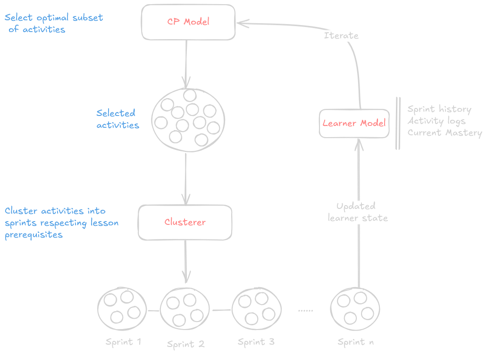

# Generating Adaptive Learning Path using Constraint Programming

## 📚 Overview

The goal of this project is to generate **personalized learning paths** for individual learners by selecting an optimal set of learning activities from a larger pool. Each learner has a unique profile—including their **initial knowledge**, **preferred learning styles**, and **difficulty preferences**—and must reach **mastery thresholds** across a set of learning objectives (lessons).

The main challenge is to ensure that:

- All **pedagogical prerequisites** between lessons are respected,
- The learner reaches a **sufficient mastery level** (e.g., ≥ 60%) for each lesson,
- The **total learning time is minimized** to improve efficiency,
- The **learner’s preferences** (styles, activity types, difficulty level) are taken into account when possible.

To model this, the project uses a **Constraint Optimization Problem (COP)** approach. Each activity contributes a set of **pedagogical gains** (per lesson), and the system must select a subset of activities such that:

- The learner’s mastery on each lesson reaches the required threshold,
- All prerequisite lessons are mastered before dependent ones,
- The total activity duration is minimized (objective function),
<!-- - Optional soft constraints prioritize matching learner preferences. -->

In addition, selected activities are grouped into **learning sprints** based on the topological structure of the lesson graph and content similarity, and the process is repeated iteratively as the learner progresses.

## ⚙️ Architecture

Pipeline:

1. Instance generation →
2. Activity selection via CP →
3. Clustering into sprints →
4. Learner model update →
5. Iteration



## 🧪 Experiments & Results

- Benchmark on synthetic datasets with different complexity levels(basic, intermediate, and advanced)
- Heuristic analysis (variable and value ordering) for the CP model

## 🧰 Tech Stack

- Python 3.13
- OR-Tools (CP-SAT)
- Scikit-learn
- NetworkX

## 📂 Project Structure

- `src/` — source ....
- `tests/` — benchmarking and testing
- `utils/` — helper functions
- `benchmarks/` — generated instances

## ✅ How to Test

1. Install python(if not installed, here Python 3.13 is used)

2. Create a virtual env and install dependencies

```bash
python -m venv .venv
source .venv/bin/activate  # On Windows: .venv\Scripts\activate
pip install ortools scikit-learn pyvis networkx
```

To test the project, run the standalone Python scripts located in the `tests/` folder. Each script checks a specific module of the system:

```bash
python tests/test_optimizer.py     # Tests the constraint optimization solver
python tests/test_clustering.py    # Tests sprint clustering logic
python tests/test_heuristics.py    # Tests solver heuristics
python tests/test_path.py          # Tests the full learning path pipeline
```

To test with a different dataset, open `utils/data_loader.py` and update the file path inside load_data():

```python
with open("benchmarks/advanced/instance_02/activities.json") as f:
```

## 📄 License

MIT (or your preferred license)

## 👨‍🎓 Author

Jean-Chrétien KOUETE — Thesis 2025
